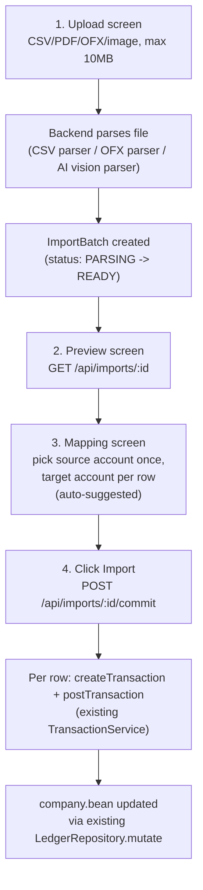

# Bank Transaction Import Wizard - Design Plan

This is a **design/architecture plan only** — no code has been written. It documents the recommended approach and open decisions for a 4-step bank/transaction import wizard (CSV/OFX/PDF/image upload -> preview -> account mapping -> commit) that extends the existing Bun+Hono+Zod backend and Next.js frontend without touching the current Beancount persistence model until the user confirms the import.

## Current architecture recap (constraints this must fit)

- Backend (`newgl-api`): Bun + Hono + `@hono/zod-openapi`, hexagonal layout — `core/` (pure domain), `domain/` (Zod schemas), `application/` (services), `infra/beancount/` (the only format-aware code), `http/routes/` (thin Hono handlers). Single source of truth is `data/company.bean`, mutated only through `LedgerRepository.mutate()`.
- Frontend (`quickslike`): Next.js, with a mirrored domain model in `quickslike/src/modules/accounting/domain/models.ts` and an HTTP client layer in `quickslike/src/lib/services/http-service-container.ts` (`HttpAccountService`, `HttpTransactionService`, etc.) implementing shared `ServiceContainer` contracts.
- Existing transaction creation flow: `POST /api/transactions` (creates DRAFT) then `POST /api/transactions/:id/post` (posts it) — see `newgl-api/src/http/routes/transactions.ts` and `newgl-api/src/application/services/transaction-service.ts`. The import commit step will reuse this exact pair of calls per row rather than inventing a new write path into the ledger.
- Nothing today models a "pending/unconfirmed batch of transactions" — that's the main new concept this feature introduces.

## Key architectural decisions

### 1. Staging model: server-side, in-memory/temp-file import batches (not client-only, not baked into the ledger)

Recommendation: introduce an **`ImportBatch`** concept that lives *outside* the Beancount store, is never written into `company.bean` until commit, and is discarded after commit/cancel or a TTL.

- Why server-side over pure client-side: duplicate detection and account-suggestion need server access to existing accounts/transactions; large PDFs/images need server-side calls to the AI provider (can't expose API keys to the browser); and a batch needs to survive a page refresh mid-wizard.
- Why not written into the ledger immediately: rows are unconfirmed/uncategorized and may have low-confidence AI extractions — writing DRAFT transactions per row would pollute the register and require cleanup on cancel.
- Storage: an in-memory `Map<batchId, ImportBatch>` inside a new `ImportStore`, mirroring the simplicity of `AsyncMutex`-guarded state in `newgl-api/src/infra/beancount/repository.ts`. Raw uploaded files are written to `data/imports/<batchId>/original.<ext>` (already-git-ignored `data/` pattern) and deleted on commit/cancel/TTL. This is fine for the current single-instance Fly.io deployment; if you later scale to multiple instances, swap `ImportStore` for a shared store (Redis/SQLite) — it's an isolated port, matching the `LedgerRepository` pattern.

### 2. AI parsing: pluggable provider port, not hardcoded to one vendor

Recommendation: define an `AiStatementParser` port (interface) with one implementation you pick now (OpenAI or Anthropic, both support vision + structured/JSON outputs) and swappable later via an `AI_PROVIDER` env var — mirrors how `LedgerRepository` is a swappable port today. This avoids blocking the whole design on the provider choice.

### 3. Reuse existing transaction pipeline for commit

Commit step iterates confirmed rows and calls the same `TransactionService.createTransaction()` + `postTransaction()` used everywhere else — no new ledger-writing code path, no risk of diverging from existing double-entry validation in `newgl-api/src/core/accounting-reports.ts`.

## Data flow

## Backend changes (newgl-api)

### New domain schemas — `newgl-api/src/domain/models.ts`
- `importSourceTypeSchema`: `"CSV" | "OFX" | "PDF" | "IMAGE"`
- `importBatchStatusSchema`: `"PARSING" | "READY" | "PARSE_FAILED" | "COMMITTING" | "COMMITTED" | "CANCELLED"`
- `importRowSchema`: `{ id, date, description, amount, suggestedAccountId?, targetAccountId?, confidence?, isDuplicate?, duplicateOfTransactionId?, status: "PENDING"|"EXCLUDED"|"IMPORTED" }`
- `importBatchSchema`: `{ id, sourceType, sourceAccountId?, status, rows: ImportRow[], createdAt, error? }`
- Request schemas: `createImportRowUpdateInputSchema` (target account + excluded flag), `commitImportInputSchema` (final sourceAccountId if not chosen earlier)

### New application layer
- `newgl-api/src/application/contracts.ts`: add `ImportService` interface — `createImportBatch(file, sourceType)`, `getImportBatch(id)`, `updateImportRow(id, rowId, patch)`, `setSourceAccount(id, accountId)`, `commitImportBatch(id)`, `cancelImportBatch(id)`.
- `newgl-api/src/application/services/import-service.ts`: implementation orchestrating parser selection, `ImportStore`, account-suggestion, duplicate-detection, and the commit loop calling `TransactionService`.
- Wire into `newgl-api/src/application/create-service-container.ts` and `service-container.ts`.

### New infra
- `newgl-api/src/infra/imports/import-store.ts`: in-memory batch store + TTL cleanup, raw file staging under `data/imports/`.
- `newgl-api/src/infra/imports/csv-parser.ts`: reuse the parsing style already in `newgl-api/scripts/seed-from-csv.ts` (simple delimiter-aware line parser); no new dependency needed.
- `newgl-api/src/infra/imports/ofx-parser.ts`: OFX is structured SGML/XML — deterministic parse, **no AI needed** (a small regex/XML parser is enough; confirm during Phase 2 whether a library like `ofx-js` is worth adding vs. hand-rolled, given the project's "no unnecessary deps" style).
- `newgl-api/src/infra/imports/ai-statement-parser.ts`: port (`interface AiStatementParser { extract(file: Buffer, mimeType: string): Promise<ParsedRow[]> }`) + one concrete adapter (OpenAI or Anthropic vision with structured/JSON-schema output) selected via `AI_PROVIDER` env var in `newgl-api/src/configuration/index.ts`.

### New pure logic in `core/` (testable, no I/O — matches existing style)
- `newgl-api/src/core/account-suggestion.ts`: score existing accounts (from `Account["name"]`/`subtype`) plus historical `Transaction.accountLabel`/`payee` pairs (via `TransactionService.listTransactions()`) against each row's description; keyword/substring/Jaccard scoring for Phase 1, upgradeable to an LLM classification call later.
- `newgl-api/src/core/duplicate-detection.ts`: flag a row as a likely duplicate if an existing POSTED transaction has the same `sourceAccountId`, a date within +/-2 days, and the same amount (tolerance from `ACCOUNTING_CONFIG.roundingTolerance`).

### New HTTP routes — `newgl-api/src/http/routes/imports.ts`, registered in `newgl-api/src/http/routes/index.ts` and `newgl-api/src/http/app.ts`
- `POST /api/imports` — multipart upload (`file`, `sourceType`), enforces 10MB limit, returns batch in `PARSING` status immediately, parsing continues async; client polls.
- `GET /api/imports/:id` — batch + rows (with suggestions + duplicate flags) for the preview/mapping screens.
- `PATCH /api/imports/:id` — set `sourceAccountId` for the whole batch.
- `PATCH /api/imports/:id/rows/:rowId` — set `targetAccountId` / exclude a row.
- `POST /api/imports/:id/commit` — validates every non-excluded row has a target account, then creates+posts transactions, returns created `Transaction[]`.
- `DELETE /api/imports/:id` — cancel, discard staged file and batch.

### Config additions — `newgl-api/src/configuration/index.ts`
- `AI_PROVIDER` (`openai` | `anthropic` | ...), `AI_API_KEY`, `MAX_IMPORT_FILE_SIZE_MB` (default 10).

## Frontend changes (quickslike)

- Mirror the new types in `quickslike/src/modules/accounting/domain/models.ts` (`ImportBatch`, `ImportRow`, etc.) and add an `ImportService` contract alongside the existing ones.
- Add `HttpImportService` to `quickslike/src/lib/services/http-service-container.ts` — same `request()` helper, but the upload call uses `FormData`/multipart instead of JSON.
- New page `quickslike/src/app/import/page.tsx` (same pattern as the existing `quickslike/src/app/register/page.tsx`).
- New components under `quickslike/src/components/import/` (mirroring the `bank-register/` folder's structure): `import-wizard.tsx` (stepper shell), `upload-step.tsx`, `preview-step.tsx`, `mapping-step.tsx` (per-row account picker, reusing `account-selector.tsx` patterns from `bank-register/`), `confirm-step.tsx`.
- `use-import-wizard.ts` hook: holds `batchId` + current step in state, polls `GET /api/imports/:id` while status is `PARSING`, exposes actions for each step.

## Duplicate detection and failure handling (behavior, not just plumbing)

- Duplicate rows are shown in the preview/mapping step with a visible "possible duplicate" badge and are excluded from commit by default (user can override).
- If AI parsing fails entirely: batch status `PARSE_FAILED` with an error message, preview screen offers "try again" or falls back to manual CSV-only entry.
- If AI parsing partially succeeds: rows with low/no confidence are flagged in the preview and are excluded from commit until the user reviews/edits them manually (edit fields inline before mapping).

## Phased delivery

- **Phase 1 (MVP):** CSV parser + manual account mapping only, no AI, no OFX. Validates the whole staging/commit pipeline end-to-end with the lowest-risk parser.
- **Phase 2:** OFX parser (deterministic, no AI dependency).
- **Phase 3:** AI vision parsing for PDF and image files via the pluggable `AiStatementParser` port; confidence flagging and partial-failure UX.
- **Phase 4:** Upgrade account-suggestion from keyword matching to historical-learning (and optionally LLM-assisted classification), refine duplicate detection thresholds based on real usage.

## Open decisions to confirm before implementation starts

- AI provider for Phase 3 (OpenAI vs Anthropic vs Google) — architected as swappable, so this can be deferred until Phase 3 actually starts.
- Whether Phase 1 should be implemented next, or this design should be reviewed/adjusted further first.
