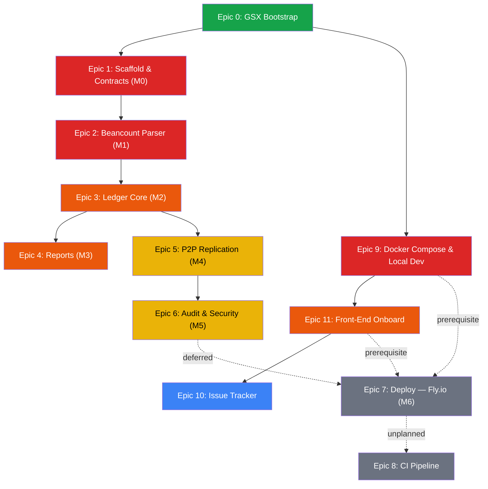

# OpenLedger — Project Roadmap

**Project:** [OpenLedger Overview](/projects/openledger/overview)
**Created:** 2026-06-27
**Last Updated:** 2026-06-27 (Roadmap Revision)

> This roadmap groups all work into **themed epics** mapped to SPEC.md milestones. Each epic has its own **folder** containing an implementation plan (`overview.md`) and session dev blogs. Use `docs/epic-worksession-workflow.md` + an epic folder to run a focused session.

---

## Epic Summary

| # | Epic | SPEC | Status | Est. Sessions | Priority |
|---|------|------|--------|--------------|----------|
| 0 | [GSX Bootstrap & Scaffolding](/projects/openledger/roadmap/epic-00-gsx-bootstrap/overview) | — | 🔄 In Progress | ~1 | 🔴 Critical |
| 1 | [Scaffold & Contracts](/projects/openledger/roadmap/epic-01-scaffold-contracts/overview) | M0 | ⬜ Not Started | ~1 | 🔴 Critical |
| 2 | [Beancount Parser & Serializer](/projects/openledger/roadmap/epic-02-beancount-parser/overview) | M1 | ✅ Done | ~2–3 | 🔴 Critical |
| 3 | [Ledger Core & Double-Entry](/projects/openledger/roadmap/epic-03-ledger-core/overview) | M2 | ✅ Done | ~2–3 | 🔴 High |
| 4 | [Reports & Read Model](/projects/openledger/roadmap/epic-04-reports-read-model/overview) | M3 | ✅ Done | ~2 | 🔴 High |
| 5 | [P2P Replication](/projects/openledger/roadmap/epic-05-p2p-replication/overview) | M4 | ✅ Done | ~3–4 | 🟡 Medium |
| 6 | [Audit, Checkpoints & Security](/projects/openledger/roadmap/epic-06-audit-security/overview) | M5 | ✅ Done | ~2 | 🟡 Medium |
| 7 | [Deploy — Fly.io](/projects/openledger/roadmap/epic-07-deploy/overview) | M6 | ⏸️ Deferred | ~1–2 | 🔵 Low |
| 9 | [Docker Compose & Local Dev](/projects/openledger/roadmap/epic-09-docker-compose/overview) | — | ⬜ Not Started | ~1–2 | 🔴 Critical |
| 11 | [Front-End Onboarding](/projects/openledger/roadmap/epic-11-frontend-onboard/overview) | — | ⬜ Not Started | ~3–4 | 🔴 High |
| 10 | [Built-In Issue Tracker](/projects/openledger/roadmap/epic-10-issue-tracker/overview) | — | ⬜ Not Started | ~2–3 | 🔵 Low |

**Total:** 12 epics · ~20–28 sessions estimated

### Unplanned — Future Epics

| # | Epic | Status | Priority | Notes |
|---|------|--------|----------|-------|
| 8 | CI Pipeline (GitLab CI + GitHub Actions) | 📋 Unplanned | 🟡 Medium | GitLab counterpart for the GitHub repo, `bun test` in CI |

---

## Dependency Graph



### Critical Paths

**SPEC Path (API):**
```
Epic 0 (Bootstrap) → Epic 1 (Scaffold) → Epic 2 (Parser) → Epic 3 (Ledger Core) → Epic 4 (Reports)
                                                                                   → Epic 5 (P2P) → Epic 6 (Audit)
```

**Local Dev Path (Infrastructure + Frontend):**
```
Epic 0 (Bootstrap) → Epic 9 (Docker Compose) → Epic 11 (Front-End Onboard) → Epic 10 (Issue Tracker)
```

**Deploy Path (deferred):**
```
Epic 6 (Audit) + Epic 9 (Compose) + Epic 11 (Frontend) → Epic 7 (Fly.io Deploy)
```

**Epic 0 is the foundation** — without GSX scaffolding, there's no workflow for developing the app.
**Epic 9 is the new top priority** — Docker Compose local dev unblocks frontend integration.
**Epic 11 bridges the frontend** — onboards newgl-ui into the monorepo with Radix UI migration.
**Epics 1–4 are the SPEC core** — schema, parser, ledger, reports (can run in parallel with 9/11).
**Epic 5 is the differentiator** — P2P replication is what makes OpenLedger unique.
**Epic 7 (Deploy) is deferred** — cloud deploy waits until the full stack works locally.

> **Practical execution:** The SPEC path (Epics 1–6) and the Local Dev path (Epics 9→11→10) can run **in parallel** from Epic 0. Epic 7 (Deploy) is gated on both paths completing.

---

## Conformance Test Obligations

The SPEC defines invariant-based conformance tests (§2.7). Each obligation is assigned to the epic that implements its invariant:

| Obligation | Invariant | Epic | Description |
|------------|-----------|------|-------------|
| CT-1 | I1 | Epic 3 | Per-currency posting sums are zero; perturbing any amount is detected |
| CT-2 | I2 | Epic 3 | One elided posting resolves balanced; two elided postings are rejected |
| CT-3 | I5 | Epic 3 | `txid` is stable across runs and identical for structurally identical transactions |
| CT-4 | I6 | Epic 4 | Union-merge yields identical balances regardless of order |
| CT-5 | I7 | Epic 2 | `parse(serialize(t))` round-trips; byte-identical re-serialization |
| CT-6 | I7 | Epic 2 | Round-trip holds against a golden `.bean` corpus |
| CT-7 | I3 | Epic 3 | Postings to unopened/closed accounts are rejected |
| CT-8 | I8 | Epic 6 | `verify()` detects tampered `txid` and dangling parent link |
| CT-9 | FR-4 | Epic 5 | Two nodes, one partitioned then reconnected, end byte-identical |
| CT-10 | §3.8 | Epic 6 | Signing on/off doesn't affect `txid`; verify accepts valid, rejects forged |
| CT-11 | §3.3 | Epic 3 | External edits disabled → node refuses to boot on unexpected file change |
| CT-12 | §3.3 | Epic 5 | External edits enabled → hand-appended transaction adopted via union-merge |

**Gating rule:** An epic is not ✅ Done until its conformance obligations pass under `bun test`.

---

## How to Use This Roadmap

### Starting a Work Session

Reference the epic worksession workflow + the specific epic page:

```
I want to work on @docs/epic-worksession-workflow.md using @roadmap/epic-01-scaffold-contracts/overview.md
```

The agent will:
1. Read the workflow → scope itself to the epic
2. Read the epic page → get the pre-written implementation plan
3. Check which issues are still open
4. Pick 2–4 issues for this session
5. Execute → commit → resolve
6. Update the epic page + this roadmap

### Status Legend

| Symbol | Meaning |
|--------|---------|
| ⬜ Not Started | No work has begun on this epic |
| 🔄 In Progress | Some issues completed, some remaining |
| ✅ Done | All issues in this epic resolved |
| 📋 Unplanned | Future work, not yet scoped into issues |

### Priority Legend

| Symbol | Meaning |
|--------|---------|
| 🔴 Critical/High | Work on these first — foundational |
| 🟡 Medium | Important but depends on foundational work |
| 🔵 Low | Future work, nice-to-haves |

---

## Phase Coverage

All SPEC.md milestones are mapped to epics:

| SPEC Feature | Epic |
|-------------|------|
| Repo, Bun project, lint/format, CI (`bun test`) | Epic 1 |
| Pothos schema matching §2.6; all resolvers stubbed | Epic 1 |
| Decimal + Date + TxId scalars | Epic 1 |
| Parser for Beancount directive subset (§2.3) | Epic 2 |
| Deterministic canonical serializer + round-trip (I7) | Epic 2 |
| `txid` hashing (I5) | Epic 2 |
| DAG structure, heads, topo order (§3.4) | Epic 3 |
| Validation pipeline (§3.5) — I1/I2 property-based tests | Epic 3 |
| `appendTransaction`, `openAccount`, `closeAccount` | Epic 3 |
| Indices (§3.7) + incremental update on append | Epic 4 |
| `trialBalance`, `balanceSheet`, `incomeStatement`, `journal`, `account` | Epic 4 |
| Perf gate: report latency from index, not file | Epic 4 |
| libp2p transport + gossipsub + discovery | Epic 5 |
| Anti-entropy head exchange + content-addressed pull | Epic 5 |
| Automerge vs hypercore spike + ADR | Epic 5 |
| Union-merge → re-serialize → byte-identical convergence | Epic 5 |
| `verify` walks DAG (I8) + signature checks | Epic 6 |
| Balance/pad checkpoint evaluation (§3.6) | Epic 6 |
| Peer signing + instance auth | Epic 6 |
| `bun build --compile`; Fly.io config with volume + IPv6 | Epic 7 (⏸️ deferred) |
| Multi-node smoke test | Epic 7 (⏸️ deferred) |

### Non-SPEC Epics (Infrastructure & Frontend)

| Feature | Epic |
|---------|------|
| Docker Compose full local dev workflow, one-liner start | Epic 9 |
| Front-end onboard — newgl-ui → monorepo, Radix UI migration | Epic 11 |
| Built-in issue tracker — GraphQL CRUD + `/issues` page (ShrikeStash pattern) | Epic 10 |

---

## References

- **Project Overview:** [OpenLedger Overview](/projects/openledger/overview)
- **SPEC.md:** [OpenLedger Specification](https://github.com/mrrobot16/openledger/blob/main/SPEC.md) — The constitutional source document
- **Pattern Reference:** [OmniMD Roadmap](/projects/omni-md/roadmap) — Documentation structure template
- **Pattern Reference:** [strix-view Roadmap](/projects/strix-view/roadmap) — Epic workflow reference
- **Pattern Reference:** [GCP Onboard Roadmap](/projects/gcp-onboard/roadmap) — Infrastructure epic reference
